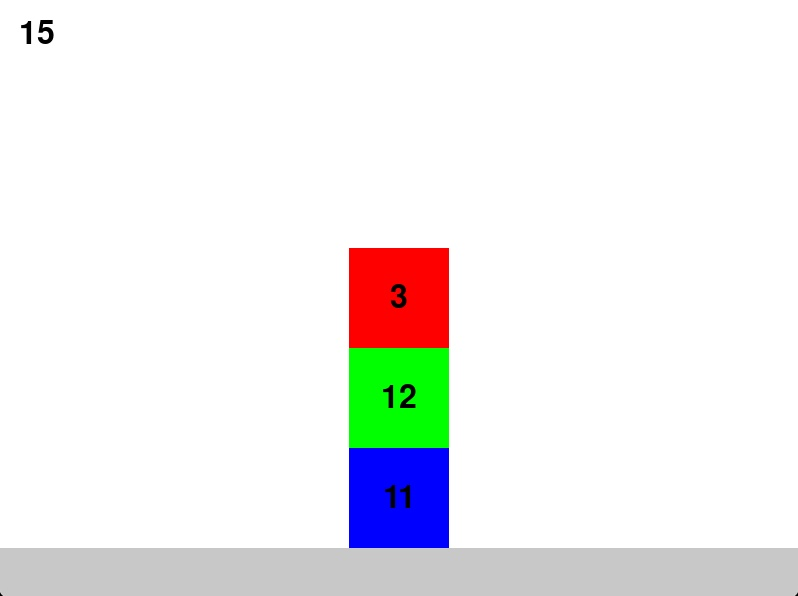

## Avaliação para o cargo de ninja de Dessoft

## Questão

Nesta avaliação de pygame faremos um jogo que testa a capacidade do jogador de calcular rapidamente a resposta de uma operação matemática. Neste jogo, o jogador deve identificar quais números geram a soma desejada e excluir o número que não faz parte da soma.

### Básico

Nesta etapa vamos criar a versão básica do jogo:

1. É criado um jogo com uma tela de tamanho $800\times 600$ no arquivo `jogo.py`.
2. O jogo apresenta três quadrados empilhados no centro da tela. Cada um deve possuir uma cor. Esses quadrados estão em cima de uma plataforma de uma cor diferente.
3. O arquivo `gerador.py` contém uma função chamada `gera_numeros`. Esta função gera 4 números inteiros aleatórios. Os três primeiros números devem ser mostrados um dentro de cada quadrado e o quarto número deve ser mostrado no canto superior esquerdo da tela. Não é necessário centralizar o número no quadrado.
4. Ao clicar em qualquer lugar dentro de um quadrado, o programa deve imprimir no terminal o número que está no quadrado.

___

### Proficiente

1. Ao clicar em um quadrado, tanto o quadrado quanto o número que está dentro dele devem sumir da tela.

2. No lugar onde estava o quadrado clicado, deve aparecer o texto "Certo!" ou "Errado!" dependendo se o número que estava no quadrado clicado faz parte da soma dos três números que estavam nos quadrados. Veja no exemplo abaixo: Quando o quadrado desaparece, caso a soma dos blocos restantes seja igual ao número que estava no canto superior esquerdo, deve aparecer "Certo!" no lugar do quadrado clicado. Caso a soma dos blocos restantes seja diferente do número que estava no canto superior esquerdo, deve aparecer "Errado!" no lugar do quadrado clicado.

3. Ao mostrar a mensagem "Certo!" ou "Errado!", o programa deve esperar pelo menos 1 segundo e depois deve reiniciar o jogo com novos números.

___

### Avançado

1. O jogo deve apresentar três telas. Uma de início com um botão "Jogar", uma de jogo (com o jogo acima) e uma de fim de jogo que mostre quantas respostas corretas o jogador acertou.

2. O jogador deve possuir três vidas. Caso a mensagem "Errado!" apareça, o jogador perde uma vida. Caso o jogador perca todas as vidas, o jogo deve mostrar a tela de fim de jogo.

4. O jogo deve durar 1 minuto. Ao final do tempo, o jogo deve mostrar a tela de fim de jogo. O tempo restante deve ser mostrado no canto superior direito da tela.

___
